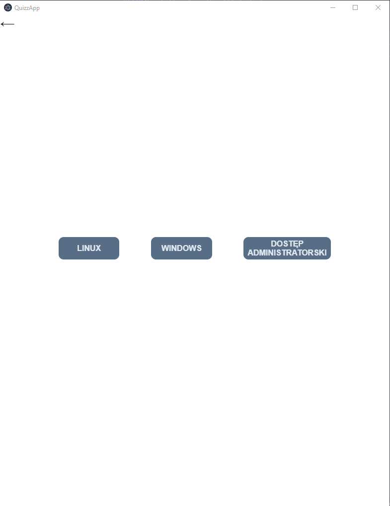
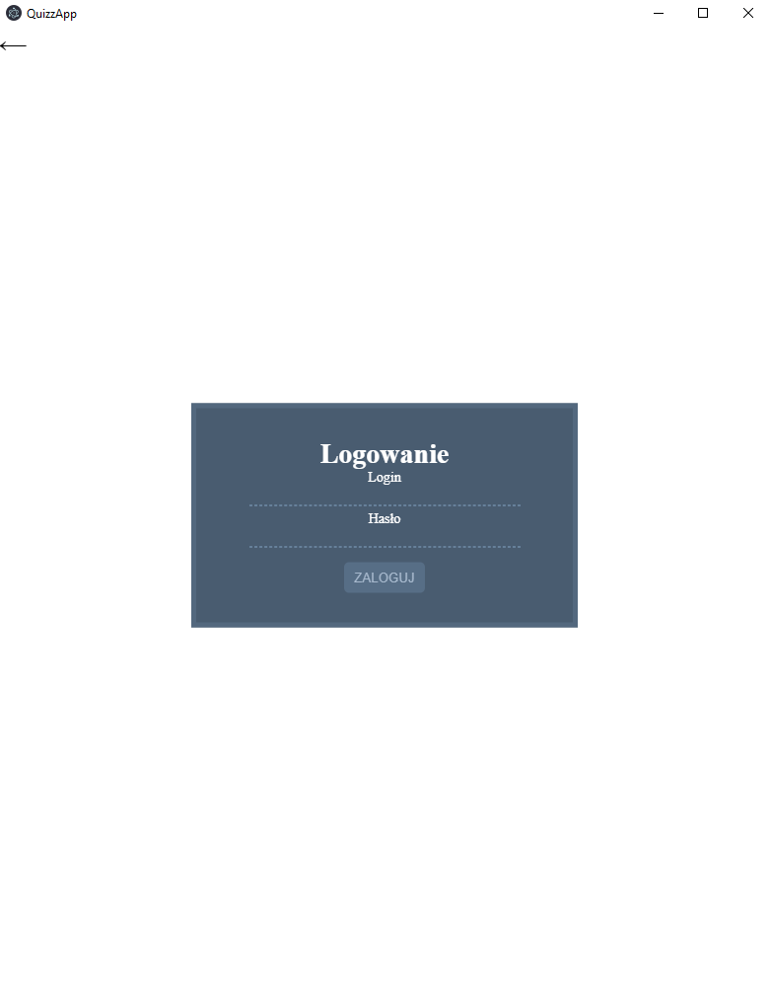
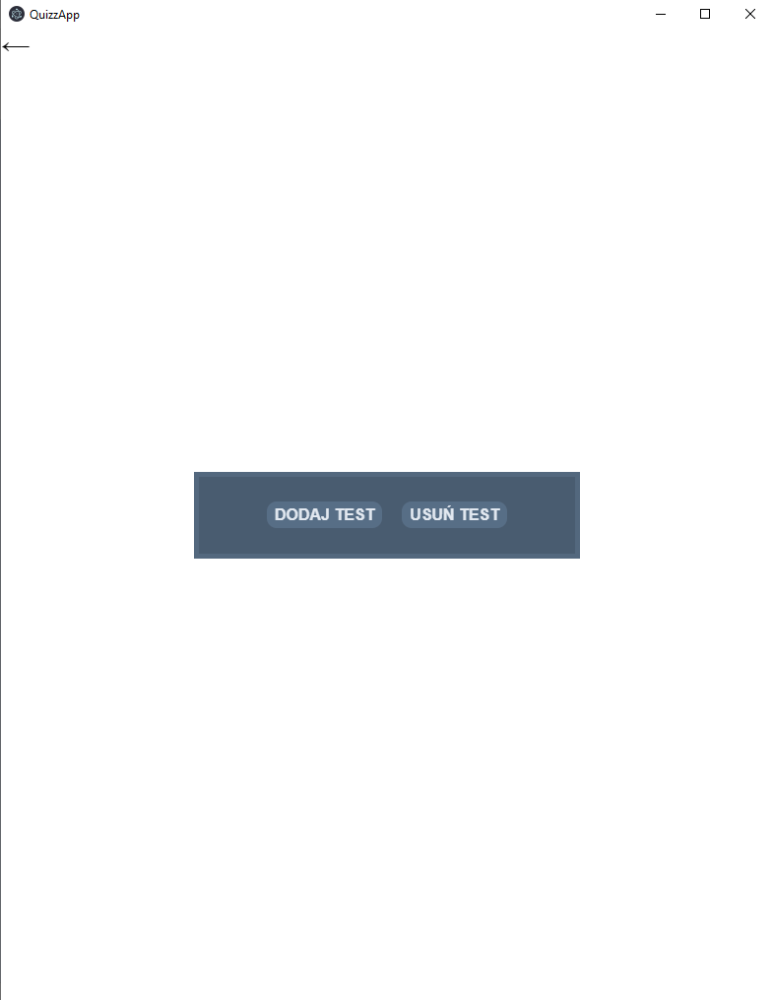
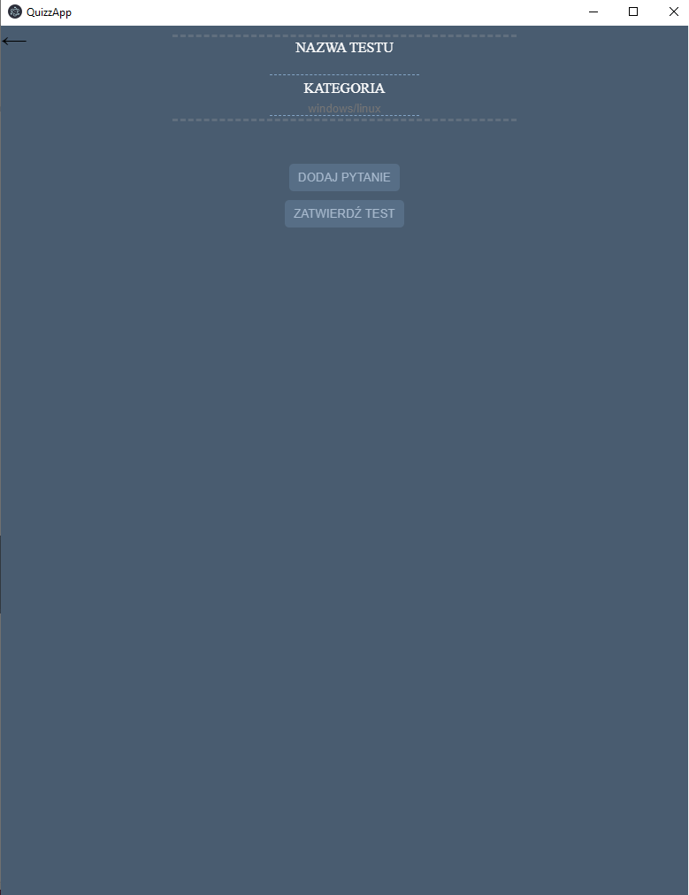
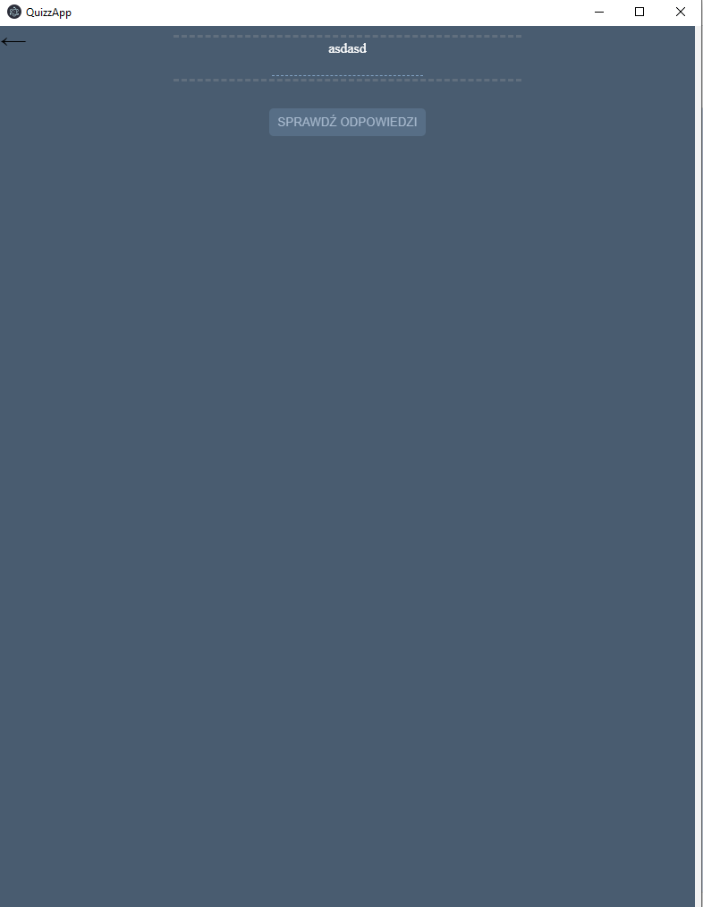

<h2>QuizzApp</h2>

Project made for a teacher in 2020 to help with checking the tests

Login: admin

Password: Passw0rd!

<ul>
	<li>Make sure to have nodejs, npm and git installed on your system</li>
	<li>
		Clone repository
	</li>
	<li>
		Install necessary dependencies
		<pre>npm install</pre>
	</li>
	<li>
		To open app in development mode run: <pre>npm run start</pre>
	</li>
	<li>
		To compile app into production ready code run:
		<ul>
			<li><pre>npm run build</pre></li>
		</ul>
	</li>
</ul>
